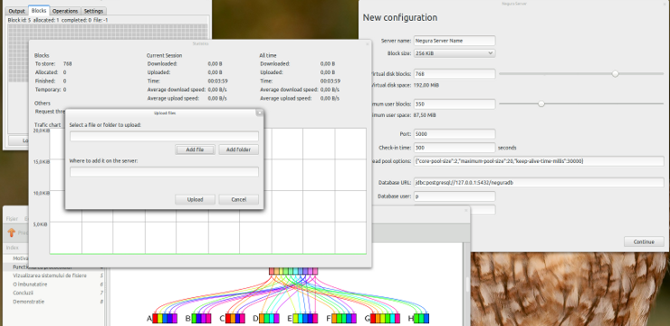

# Negura

Negura is a distributed file system based on peer-to-peer networking written in
Java. This was the project for my bachelor thesis. The documents are available
in Romanian: [thesis][thesis], [slides][slides].

## Resources

The application icon is from [Komodo Media][km].

## License

MIT

[thesis]: doc/licen%C8%9B%C4%83/licen%C8%9B%C4%83.pdf
[slides]: doc/prezentare/prezentare.pdf
[km]: http://www.komodomedia.com
